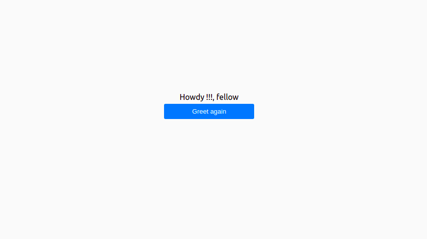

# Hello-Frontend-App
Implements a connection between a Ruby on Rails back-end and React front-end in two applications with different repositories. 
the app reads random greeting the rails application and displays it

## Note
This project contains two separate repositories: * hello-backend * hello-frontend-app.

### back-end repo is here

https://github.com/banlon-jones/hello-backend

### frontend repo

https://github.com/banlon-jones/hello-frontend-app

## Built With 
 - React
 - Redux

## Getting started
to run the project locally, clone the project using the command 

`git clone https://github.com/banlon-jones/bookstore.git`
navigate in to the project directory, 

### run `npm install`

## Available Scripts

In the project directory, you can run:

### `npm start`

Runs the app in the development mode.\
Open [http://localhost:3000](http://localhost:3000) to view it in your browser.

The page will reload when you make changes.\
You may also see any lint errors in the console.

### `npm test`

Launches the test runner in the interactive watch mode.\
See the section about [running tests](https://facebook.github.io/create-react-app/docs/running-tests) for more information.

### `npm run build`

Builds the app for production to the `build` folder.\
It correctly bundles React in production mode and optimizes the build for the best performance.

The build is minified and the filenames include the hashes.\
Your app is ready to be deployed!

## Author

### Author 1
 - Github: [banlon-jones](https://github.com/banlon-jones)
 - LinkedIn: [banlon jones](https://www.linkedin.com/in/banlon-jones-b0205812a)
 - Twitter: [@banlonjones](https://twitter.com/banlonjones)

## Acknowledgments

Thanks to the Microverse team with the structure of the project
